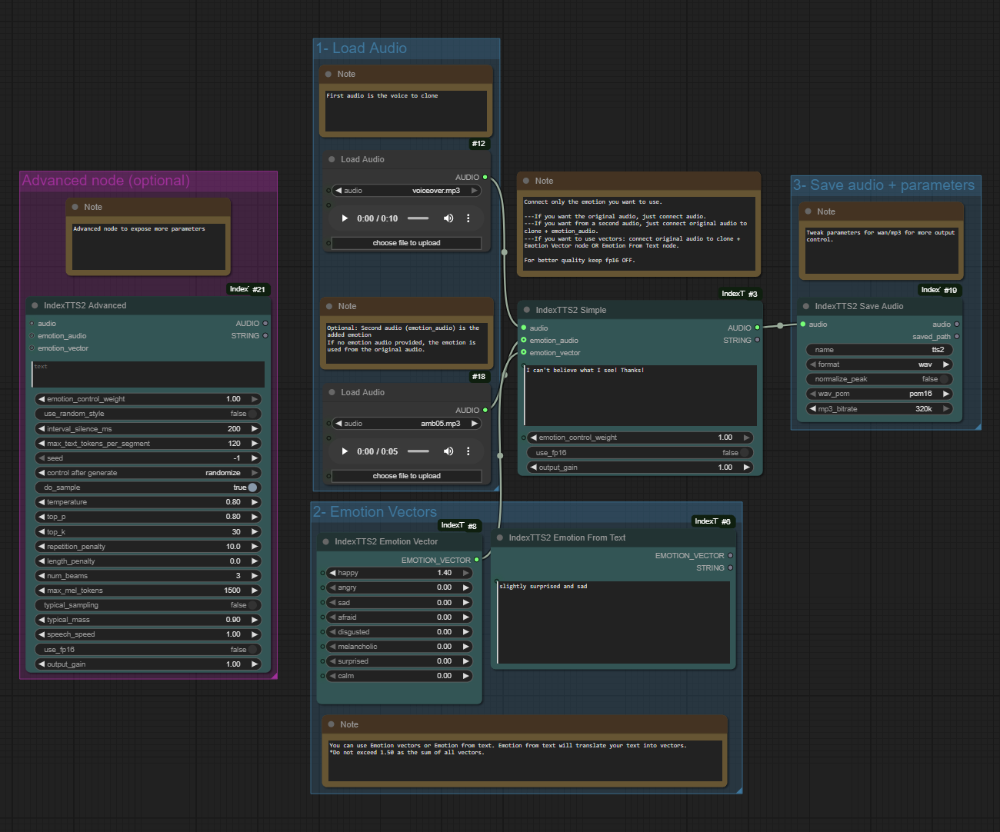

zyk-ComfyUI-IndexTTS2
=================

Lightweight ComfyUI wrapper for IndexTTS 2 (voice cloning + emotion control) — **zyk fork**. Nodes call the upstream inference code so behaviour stays matched with the original repo.

Original repo: https://github.com/index-tts/index-tts



## Updates
- 2026-06-10: Added **zyk-IndexTTS2 Volume Adjust** (gain control + peak limiting) and **zyk-IndexTTS2 Denoise** (AI-powered noise reduction via DeepFilterNet) nodes.
- 2025-10-13: Save Audio node now acts as an output node with an embedded player overlay for instant preview inside the graph (no need for downstream preview nodes).
- 2025-10-08: Default FP32 with optional FP16 toggle, output gain control, and a Save Audio helper node (wav/mp3 + quality parameters).
- 2025-09-22: Added zyk-IndexTTS2 Advanced node exposing sampling, speed, seed, and other generation controls.

## Install
- Clone this repository into `ComfyUI/custom_nodes/`
- Inside your ComfyUI Python environment:
  ```bash
  pip install wetext
  pip install -r requirements.txt
  ```
- The **Denoise** node requires `deepfilternet`, which needs the **Rust** toolchain to compile its core library:
  ```bash
  curl --proto '=https' --tlsv1.2 -sSf https://sh.rustup.rs | sh
  source "$HOME/.cargo/env"
  pip install deepfilternet
  ```

## Models
- Create `checkpoints/` in the repo root and copy the IndexTTS-2 release there (https://huggingface.co/IndexTeam/IndexTTS-2/tree/main). Missing files will be cached from Hugging Face automatically.
- The **Denoise** node automatically downloads its models from ModelScope (China, fast) or GitHub (fallback) on first use into `checkpoints/audio_denoise/`.

## Nodes

### TTS Nodes
- **zyk-IndexTTS2 Simple** - speaker audio, text, optional emotion audio/vector; outputs audio + status string. Default FP32, optional FP16 toggle, output gain control.
- **zyk-IndexTTS2 Advanced** - Simple inputs plus overrides for sampling, speech speed, pauses, CFG, seed, FP16 toggle, and output gain.
- **zyk-IndexTTS2 Emotion Vector** – eight sliders (0.0–1.4, sum <= 1.5) producing an emotion vector.
- **zyk-IndexTTS2 Emotion From Text** – requires ModelScope and local QwenEmotion; turns short text into an emotion vector + summary.
- **zyk-IndexTTS2 Save Audio** - saves generated audio tensors to disk with wav/mp3 options and surfaces an inline player directly on the node after execution.

### Audio Processing Nodes
- **zyk-IndexTTS2 Volume Adjust** - Adjust audio volume with dB gain control (-20 to +20 dB) and optional peak limiting to prevent clipping. Includes an `enabled` toggle to bypass the node.
- **zyk-IndexTTS2 Denoise** - AI-powered noise reduction using DeepFilterNet (v1/v2/v3). Parameters: model selection (3 versions), noise reduction strength (0-2), post-filter toggle, and `enabled` bypass switch. Models auto-download from ModelScope (China) or HuggingFace on first use.

### Parameters

| Node | Parameter | Type | Range | Default | Description |
|------|-----------|------|-------|---------|-------------|
| Volume Adjust | `enabled` | BOOLEAN | — | True | Disable to pass audio through unchanged |
| Volume Adjust | `gain_db` | FLOAT | -20 ~ +20 (step 0.5) | 0.0 | Volume adjustment in decibels |
| Volume Adjust | `peak_limit` | BOOLEAN | — | True | Prevent clipping when boosting volume |
| Denoise | `enabled` | BOOLEAN | — | True | Disable to pass audio through unchanged |
| Denoise | `model` | COMBO | DeepFilterNet/2/3 | DeepFilterNet2 | Denoising model version |
| Denoise | `strength` | FLOAT | 0.0 ~ 2.0 (step 0.1) | 1.0 | Noise reduction intensity |
| Denoise | `post_filter` | BOOLEAN | — | True | Extra residual noise suppression |

## Examples
- Speaker audio -> zyk-IndexTTS2 Simple -> Preview/Save Audio
- Speaker + emotion audio -> zyk-IndexTTS2 Simple -> Save
- Emotion Vector -> zyk-IndexTTS2 Simple -> Save
- Emotion From Text -> zyk-IndexTTS2 Simple -> Save
- TTS output -> Volume Adjust (+6dB, peak_limit) -> Save
- TTS output -> Denoise (DeepFilterNet2, strength 1.2) -> Save

## Troubleshooting
- Windows only so far; DeepSpeed is disabled.
- Install `wetext` if the module is missing on first launch.
- Emotion vector sum must stay <= 1.5.
- If `deepfilternet` fails to install, ensure Rust is installed (`curl https://sh.rustup.rs | sh`).